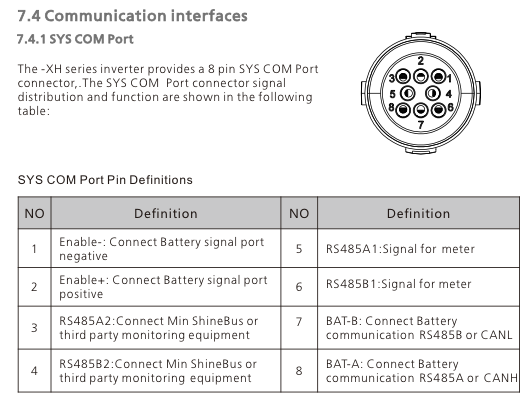
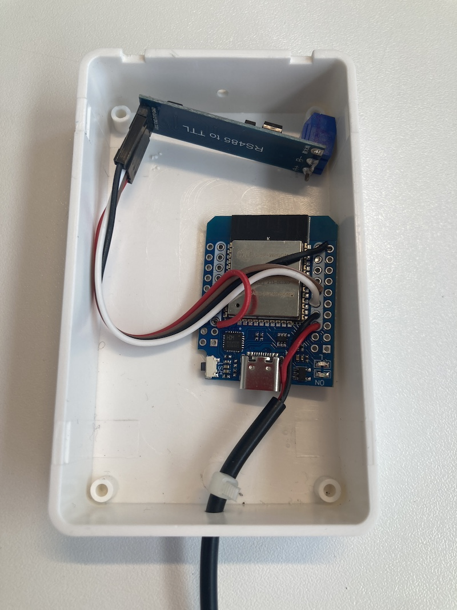
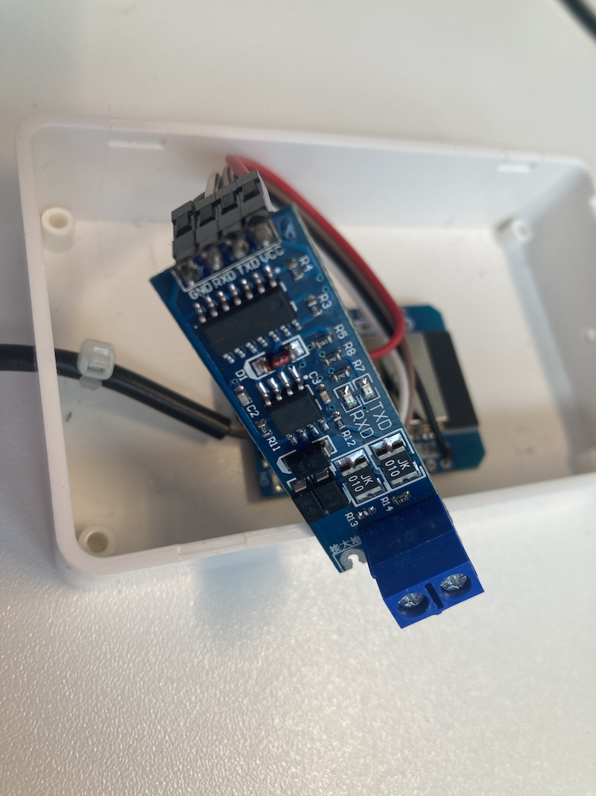

Projektbeschreibung / Project Description
Deutsch:
Dieses Projekt emuliert einen Eastron SDM630 Energiezähler über RS485/Modbus mit Hilfe von ESPHome und einem Shelly 3EM. Es stellt die vom Shelly gemessenen Strom- und Energiewerte so bereit, als kämen sie von einem echten SDM630. Ideal für Systeme oder Software, die Daten von einem SDM630 erwarten, aber stattdessen den Shelly 3EM verwenden sollen.

Hauptfunktionen:

Emuliert die Modbus-Register eines SDM630.

Nutzt die realen Messwerte vom Shelly 3EM über ESPHome.

Perfekt zur Integration in Hausautomationen oder Energiemonitoring-Systeme, die auf den SDM630 ausgelegt sind.
________________________________________
English:
This project emulates an Eastron SDM630 energy meter over RS485/Modbus using ESPHome and a Shelly 3EM. It presents the power and energy data measured by the Shelly as if it were coming from a real SDM630. Ideal for systems or software that expect an SDM630 but should actually use a Shelly 3EM instead.

Key Features:

Emulates the Modbus registers of an SDM630.

Uses real-time readings from the Shelly 3EM via ESPHome.

Perfect for integration into home automation or energy monitoring systems designed for the SDM630.
# Original Github-Projekt: https://github.com/hankipanky/esphome-fake-eastron-SDM630
# Original Yaml: https://github.com/hankipanky/esphome-fake-eastron-SDM630/blob/master/fake-eastron.yaml
# Original Modbus - Dateien: https://github.com/hankipanky/esphome-fake-eastron-SDM630/blob/master/esphome/components/modbus_server/modbus_server.h und 
# https://github.com/hankipanky/esphome-fake-eastron-SDM630/blob/master/esphome/components/modbus_server/modbus_server.cpp
# Original Github basiert auf ESPHome 2024.5 und einem Shelly 3EM Pro, dieses Projekt hier auf ESPHome 2025.3.3 und einem Shelly 3EM
# Folgender ESP wird verwendet: https://www.amazon.de/dp/B0D86Q1RJ2
# Folgender RS485-Adapter: https://www.amazon.de/dp/B099DRKBGQ
##################################
## Goal

This project allows you to provide live data from a [Shelly Pro 3 EM](https://www.shelly.com/en-us/products/shop/shelly-pro-3-em) smart meter to a solar inverter that expects an [Eastron SDM630](https://www.eastroneurope.com/products/view/sdm630modbus).

## How is this working?

The project provides an ESPhome component acting as a Slave/Client/Server that can be polled by a master (e.g. a solar inverter) via Modbus RTU. It behaves as much as possible like the Eastron SDM630 while fetching the actual data from the Shelly smart meter.

### How exactly?

* On boot, the ESPhome starts a Modbus slave on address 2. This is where Growatt expects to find the vanilla Eastron SDM630 Modbus V2. It registers several input registers that can be queried by a Modbus master.
* At 1s intervals, it makes a HTTP GET request to the Shelly smart meter, fetching live data.
* The JSON-data is parsed, converted to IEEE-754 float and written to the matching registers.
* The inverter queries the Modbus slave several times a second, fetching the input registers in various groups.

## Why?

I use a Growatt MIN 4200TL-XH hybrid inverter. The inverter only supports two types of smart meters, which must be connected via RS485:

* Eastron SDM630 Modbus V2 or V3
* CHINT smart meter from Growatt

In my case the inverter is installed in a different room relatively far away from the grid connection. Having a two-wire RS485 connection running through the house is not an option. Also, I have a Shelly Pro 3EM smart meter installed. 

Since the Shelly is LAN-connected, this simple ESPhome project bridges manufacturer, distance, physical layer and protocol.

## Installation

1. Connect ESP32 dev board to RS485 module.
2. Connect RS485 A and B connectors to pins 5 (A) and 6 (B) of the Growatt SYS COM port.
3. Build and flash the firmware based on the [sample ESPhome config](./fake-eastron.yaml).
4. Enable meter-reading in Growatt **TODO: explain how**
5. Power-cycle the inverter completely.

**TODO: fritzing or image from breadboard**

### Modbus address

Growatt expects different smart meters at different slave addresses:

| Meter | Phases | Slave address |
|---------|----------|-----------------|
| Eastron SDM230 | 1 | 1 |
| Eastron SDM630 v2 | 3 | 2 |
| Eastron SDM630 v3 | 3 | 3 |

Eastron SDM630 **v3** is a custom version with firmware influenced by Growatt. My understanding is that it allows a higher rate of request/responses, resulting in finer tracking of power demands.

## External documentation & tools

* [Eastron SDM630 Modbus Protocol](docs/SDM630-Modbus_Protocol.pdf)
* [Shelly Pro 3 EM](https://shelly-api-docs.shelly.cloud/gen2/Devices/Gen2/ShellyPro3EM)
* [Growatt Modbus RTU Protocol](docs/Growatt-Inverter-Modbus-RTU-Protocol-II-V1-24-English-new.pdf)
* [ESP32 NodeMCU pinout](docs/ESP-32_NodeMCU_Developmentboard_Pinout.pdf)
* [IEEE-754 Floating Point Converter](https://www.h-schmidt.net/FloatConverter/IEEE754.html)
* [Online Modbus Parse](https://rapidscada.net/modbus/)
* Python tool to query an Eastron; for testing/verification: [https://github.com/nmakel/sdm_modbus](https://github.com/nmakel/sdm_modbus)

## Some thoughts

* I want to have as little elements involved in this as possible. Other projects use an MQTT broker between smart meter and ESP, which could become unavailable. Therefore I use direct communication between the two.
* Shelly always reports the power factor as a positive value. Eastron reports it as negative when exporting power. Therefore I'm calculating the powerfactor myself, rather than using the values provided by the Shelly.
* I would prefer to use Modbus TCP to query the Shelly. Not sure if ESPhome supports this.
* The inverter is constantly adjusting the charge/discharge rate of the battery, trying to avoid importing power. My observations show that the inverter "overshoots" by ~50W to achieve this. As a result, the installation is constantly exporting a little bit of power to the grid. In order to avoid this, I'm adjusting the reported values for active and aparent power by 20W per phase. This balances the import/export at around -5..5W.
